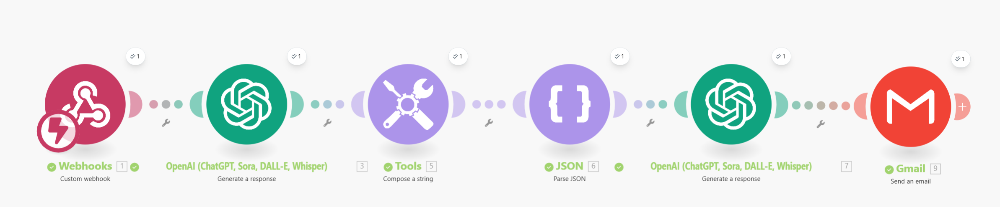

# Daily Content Generator for Instagram and LinkedIn

An automated workflow built on [Make.com](https://www.make.com/) that searches for the latest AI news and generates ready-to-post LinkedIn content and Instagram reel scripts daily.

## 🎯 What This Does

This workflow automatically:
-  Searches for the most important AI news from the past 4-5 days
-  Parses news data (title, summary, URL)
-  Generates an Instagram reel script (150 words)
-  Creates a LinkedIn post with proper formatting
-  Emails everything to you in a clean HTML format

## 📋 Prerequisites

Before you start, make sure you have:
-  Make.com account (free tier works)
-  OpenAI API key ($5 minimum charge to use OpenAI Assistant)
-  Gmail account connected to Make.com

## 📧 Sample Output Email


*Example of the daily email with AI news summary, LinkedIn post, and Instagram script*

## 🔄 Complete Workflow Diagram

```
Webhook Trigger → OpenAI Assistant (News Search) → Tools (Compose String) → 
JSON Parser → OpenAI Assistant (Content Generation) → Gmail (Send Email)
```


*Full automation flow from webhook trigger to email delivery*

## 🛠️ Step-by-Step Setup

The detailed setup instructions are provided in the **Make.com_Agents_DailyContentGenerator.pdf** document. Please refer to the PDF for comprehensive step-by-step guidance on:

- Creating your Make.com scenario
- Setting up webhook triggers
- Configuring OpenAI Assistant modules 
- Setting up JSON parsing
- Configuring content generation using Prompts
- Setting up Gmail integration
- Testing and scheduling your workflow

## 💡 Customization Ideas

-  Add image generation (DALL-E module)
-  Include Twitter/X post generation
-  Save content to Google Sheets
-  Add Slack notifications
-  Filter news by specific topics (add keywords to prompt)

## 📚 Tutorial Reference

Based on: **[Ishan Sharma - Build Your First AI Agent in 15 Minutes](https://www.youtube.com/watch?v=lIDIEKkRrGI&t=610s)**

**License**: Free to use and modify for personal projects.

